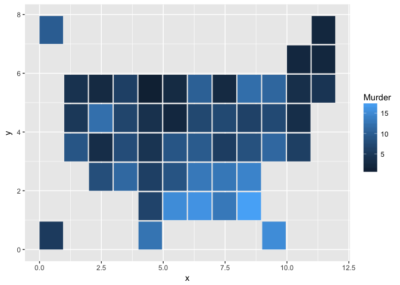
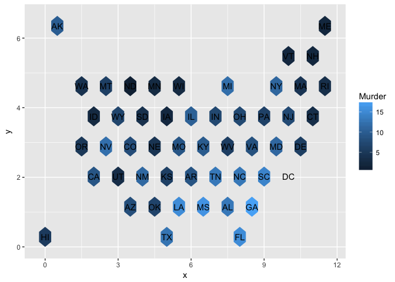
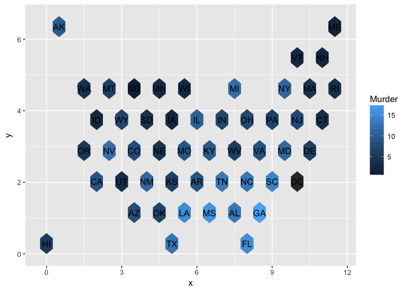
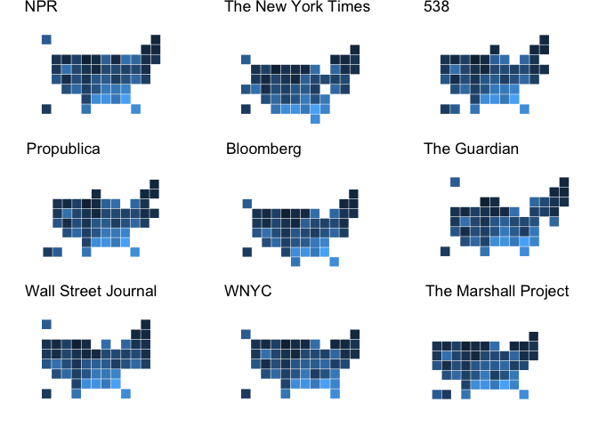

<!-- README.md is generated from README.Rmd. Please edit that file -->
Overview
--------

R functions for creating square and hextile maps for various countries (only USA for now).

Installation
------------

``` r
# install.packages("devtools")
devtools::install_github("EmilHvitfeldt/tilemapr")
```

Usage
-----

Tile grid maps are good alternative when the population isn't of much interest. Below we see a minimal example using ggplot2 and `geom_map()`:

``` r
library(tidyverse)
#> Loading tidyverse: ggplot2
#> Loading tidyverse: tibble
#> Loading tidyverse: tidyr
#> Loading tidyverse: readr
#> Loading tidyverse: purrr
#> Loading tidyverse: dplyr
#> Conflicts with tidy packages ----------------------------------------------
#> filter(): dplyr, stats
#> lag():    dplyr, stats
library(tilemapr)

# Creating data
crimes <- data.frame(state = tolower(rownames(USArrests)), USArrests)
states_map <- square_usa()

ggplot(crimes, aes(map_id = state)) +
  geom_map(aes(fill = Murder), map = states_map) +
  expand_limits(x = states_map$long, y = states_map$lat)
```



All the functions include a number of parameters to control the resulting data.frame. The two most important ones are the `d` and `center`. `d` is a kind of diameter parameter which is used to control the size of the tiles. And `center` make the function gives us a data.frame with the coordinates of the center of the tile.

``` r
states_map <- hex_usa(d = 0.5)

ggplot(crimes, aes(map_id = state)) +
  geom_map(aes(fill = Murder), map = states_map) +
  expand_limits(x = states_map$long, y = states_map$lat) +
  geom_text(data = hex_usa(d = 0.5, center = TRUE), 
            aes(x = long, y = lat, label = region_abr), 
            inherit.aes = FALSE)
```



We see here that DC is floating, this will be a common issue. It can be resolved by either removing it with `exclude` or to plotting a dataless map underneath:

``` r
states_map <- hex_usa(d = 0.5)

ggplot(states_map, aes(map_id = region)) +
  geom_map(aes(), map = states_map) +
  geom_map(data = crimes, map = states_map,
           aes(fill = Murder, map_id = state)) +
  expand_limits(x = states_map$long, y = states_map$lat) +
  geom_text(data = hex_usa(d = 0.5, center = TRUE), 
            aes(x = long, y = lat, label = region_abr), 
            inherit.aes = FALSE)
```



Lastly some of the functions have different layout, which are picked using the `style`.


